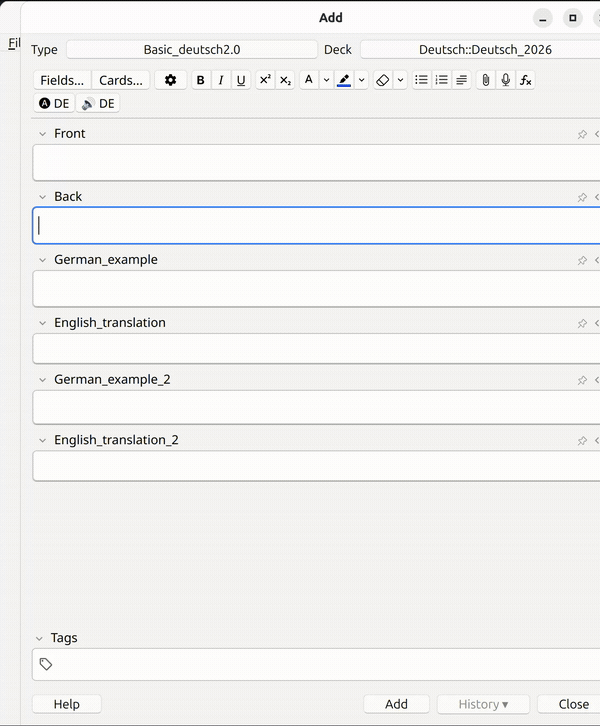

# EasyFiller (Anki add-on)



One keypress turns a bare word into a complete flashcard — meaning, example
sentences, translations, and pronunciation — using a local LLM CLI (**Claude** or
**Ollama**) and the free **edge-tts** voices. Ships configured for German, but works
for **any language** by editing the config (see [Use another language](#use-another-language)).

From a word in the source field (**Back** by default):

- **Generate** (`Ctrl+Shift+G`) — call the configured LLM CLI to fill the meaning
  (**Front**) plus two example sentences and their translations. Only *empty*
  fields are filled. Before writing it also:
  - **rewrites the word to its dictionary form** (e.g. `herausforderung` →
    `die Herausforderung`, `studiert` → `studieren`), while keeping at least one
    example in the form you typed (toggle with `normalize_word`);
  - **checks every deck for duplicates** — if the word (or its dictionary form)
    already exists, a dialog offers **See duplicate / Cancel / Generate anyway**.
- **Pronounce** (`Ctrl+Shift+P`) — silently add TTS audio (`[sound:...]`) to the
  configured fields via the **edge-tts** CLI (free Microsoft Neural voices, no API
  key). Fields that already contain audio are skipped.
- **Both** (`Ctrl+Shift+B`) — generate, then pronounce.

Linux only.

## Prerequisites

1. **An LLM CLI** for your chosen `provider` (default `claude`):
   - **Claude Code CLI** installed and signed in (`claude` works in a terminal). Auth uses
     your Claude Code login — no API key is stored. The add-on prefers the self-contained
     native binary `~/.local/bin/claude` and repairs `PATH` for node-based shims automatically.
   - or **Ollama** running locally with your model pulled (`ollama pull llama3.1`); set
     `"provider": "ollama"` and `"ollama_model"` in the config. Fully offline.
2. **edge-tts** CLI installed and on `PATH` (`pipx install edge-tts`, or
   `uv tool install edge-tts`). Default voice *de-DE-AmalaNeural*, rate +25%.
3. A note type whose field names match `config.json` (`Back`, `Front`, `German_example`,
   `English_translation`, `German_example_2`, `English_translation_2`) — or edit the config.

## Install

Dev (symlink into Anki, edits stay in sync — just restart Anki):
```bash
./install.sh
```

Packaged file (to share / install elsewhere):
```bash
./build.sh        # produces ../german_autofill.ankiaddon
```
Then in Anki: **Tools → Add-ons → Install from file…**

Or copy/symlink this folder to `~/.local/share/Anki2/addons21/german_autofill`.

> The internal package id and folder are `german_autofill`; only the display name
> ("EasyFiller") differs — that's normal for Anki add-ons.

## Configure

**Tools → Add-ons → EasyFiller → Config**. Change field names, shortcuts, TTS
voice/speed/pitch, `normalize_word`, or the `provider` (Claude or Ollama) and its
path/model. Full list in [`config.md`](config.md).

## Use another language

Nothing is hard-coded to German — it's all config:

- **`tts_voice`** — pick a voice for your target language (list them with
  `edge-tts --list-voices`), e.g. `fr-FR-DeniseNeural`, `es-ES-ElviraNeural`.
  edge-tts offers **300+ voices across 140 locales (~75 languages)** — browse and
  preview them in this
  [Edge-TTS voice playground](https://huggingface.co/spaces/innoai/Edge-TTS-Text-to-Speech).
- **`llm_prompt`** — set a custom prompt for the new language. It must keep the
  `{word}` placeholder and return the same minified JSON shape
  (`{"canonical": ..., "meaning": ..., "examples": [{"de","en"}, ...]}`). Include
  `canonical` if you want `normalize_word` to keep working.
- **field names** — point `source_field`, `meaning_field`, `example_fields`,
  `translation_fields`, and `tts_fields` at your note type's fields.

## Files

- `__init__.py` — buttons, shortcuts, duplicate check, dictionary-form rewrite, and
  mapping results into empty fields.
- `llm_client.py` — runs the configured LLM CLI (Claude or Ollama) and parses JSON
  (no Anki imports; runs in a background thread).
- `tts.py` — runs the `edge-tts` CLI in a background thread; inserts `[sound:]` on the main thread.
- `dialogs.py` — the styled duplicate-found dialog.
- `overlay.py` / `loaders.py` — the in-editor loading overlay and its spinners.
- `util.py` — HTML/field helpers.
